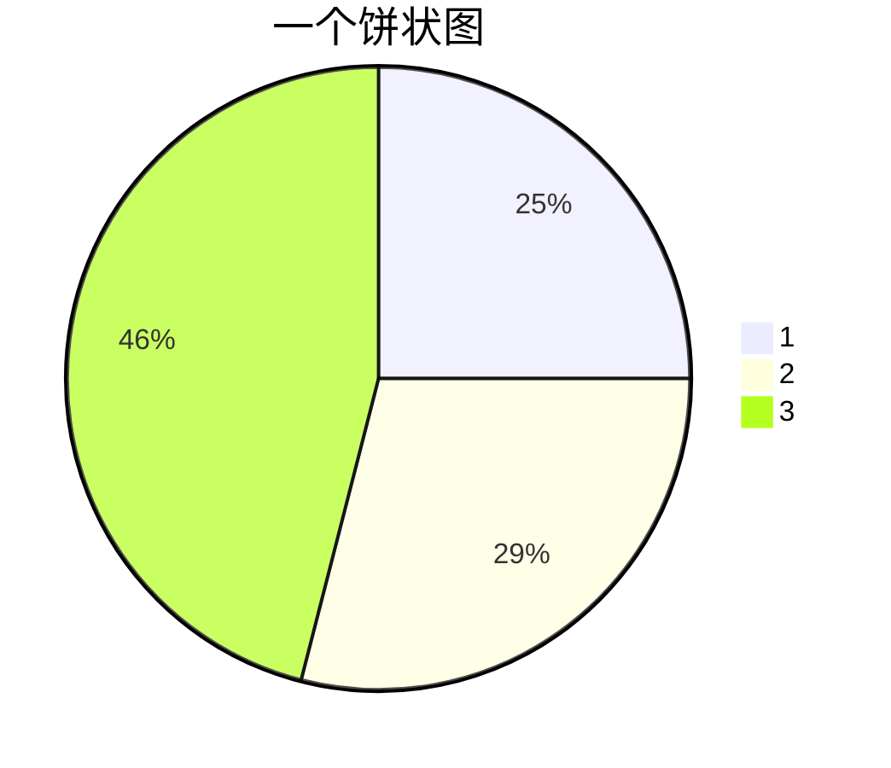
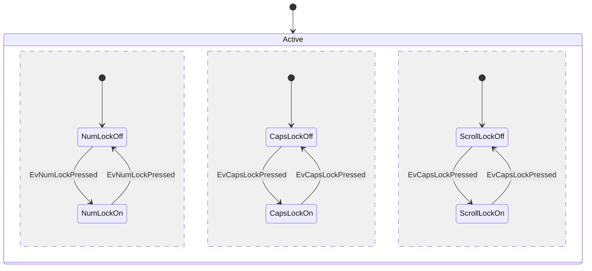
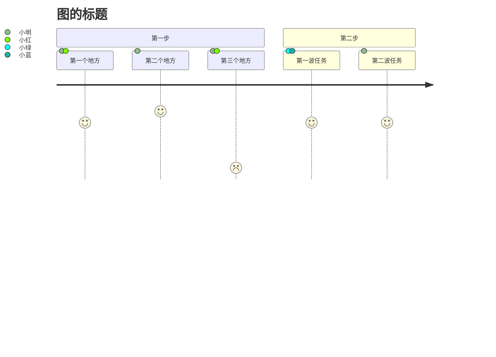

# Mermaid能绘制的内容

|     关键字     |   图类型   |     关键字     | 图类型 |
| :------------: | :--------: | :------------: | :----: |
|     `pie`      |   饼状图   |    `graph`     |   图   |
|     `flow`     |   流程图   |    `gantt`     | 甘特图 |
| `classDiagram` |    类图    | `stateDiagram` | 状态图 |
|   `journey`    | 用户旅程图 |                |        |

## 图（Graph）



## 类图（classDiagram）



## 甘特图（gantt）




# 饼状图

## 饼图示例

```





pie
title 一个饼状图
"1": 25
"2": 29
"3": 46




# 状态图

有点不想详细了解了，大家可以看下简单实用方法

```




stateDiagram-v2
    [*] --> Active
state Active {
    [*] --> NumLockOff
    NumLockOff --> NumLockOn : EvNumLockPressed
    NumLockOn --> NumLockOff : EvNumLockPressed
    --
    [*] --> CapsLockOff
    CapsLockOff --> CapsLockOn : EvCapsLockPressed
    CapsLockOn --> CapsLockOff : EvCapsLockPressed
    --
    [*] --> ScrollLockOff
    ScrollLockOff --> ScrollLockOn : EvCapsLockPressed
    ScrollLockOn --> ScrollLockOff : EvCapsLockPressed
}



# 用户旅程图

## 图参数

- title： 图的标题

- section：活动名称
  - 具体活动描述:完成程度:参与人员1,参与人员2

## 图示例

```





journey
    title 图的标题
    section 第一步
      第一个地方: 5: 小明, 小红
      第二个地方: 6: 小明
      第三个地方: 1: 小明, 小红
    section 第二步
      第一波任务: 5: 小绿, 小蓝
      第二波任务: 5: 小明




