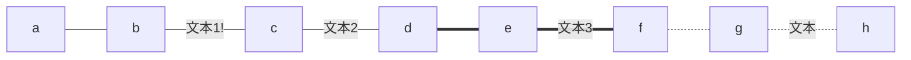
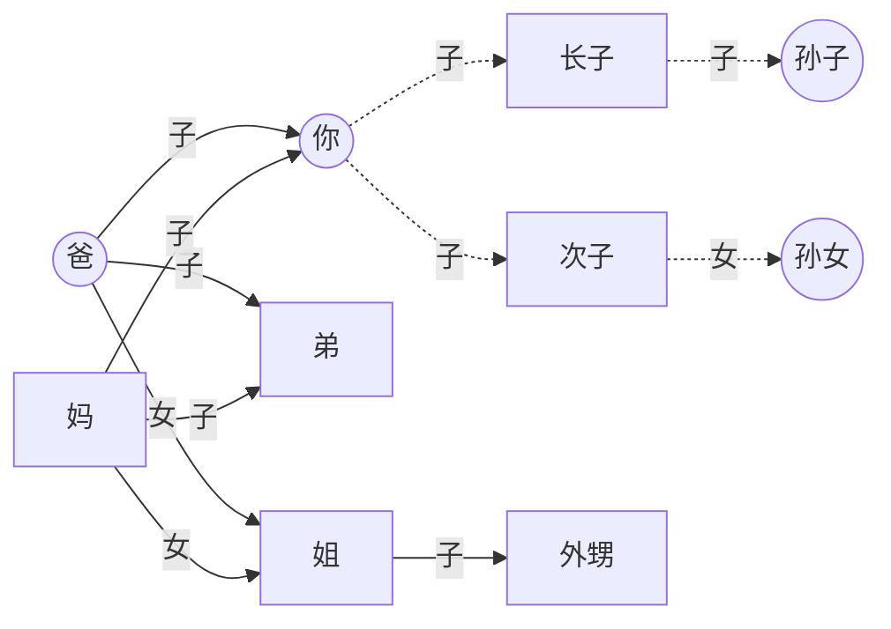

# Mermaid能绘制的内容

|     关键字     |   图类型   |     关键字     | 图类型 |
| :------------: | :--------: | :------------: | :----: |
|     `pie`      |   饼状图   |    `graph`     |   图   |
|     `flow`     |   流程图   |    `gantt`     | 甘特图 |
| `classDiagram` |    类图    | `stateDiagram` | 状态图 |
|   `journey`    | 用户旅程图 |                |        |

## 类图（classDiagram）



## 甘特图（gantt）



## 其他类型图（pie、stateDiagram、journey）




# Mermaid图(Graph)

## 相关参数

### 图方向

- `graph`或`graph TB`或`graph TD`：从上往下
- `graph BT`：从下往上
- `graph LR`：从左往右
- `graph RL`：从右往左

### 图形状

```
graph
	id1[方形]
    id2(圆边矩形)
    id3([体育场形])
    id4[[子程序形]]
    id5[(圆柱形)]
    id6((圆形))
```




graph
	id1[方形]
    id2(圆边矩形)
    id3([体育场形])
    id4[[子程序形]]
    id5[(圆柱形)]
    id6((圆形))




### 图线型

```




graph LR
    a---b
    b--文本1!---c
    c---|文本2|d
    d===e
    e==文本3===f
    f-.-g
    g-.文本.-h



```
```mermaid
flowchart LR
    A o--o B
    B <--> C
    C x--x D
## 其他线性需要用flowchart
```



flowchart LR
    A o--o B
    B <--> C
    C x--x D



## 子图

```
```memaid
flowchart TB
    c1-->a2
    subgraph one
    a1-->a2
    end
    subgraph two
    b1-->b2
    end
    subgraph three
    c1-->c2
    end
    one --> two
    three --> two
    two --> c2
```



flowchart TB
    c1-->a2
    subgraph one
    a1-->a2
    end
    subgraph two
    b1-->b2
    end
    subgraph three
    c1-->c2
    end
    one --> two
    three --> two
    two --> c2



## 图示例

```




graph LR
    you((你))-.子.->son{长子}-.子.->grandson((孙子))
    you-.子.->次子-.女.->granddaught((孙女))
	father((爸)) --子-->弟
	father --子-->you
	father --女-->sister{姐}
	妈 --子-->弟
	妈 --子-->you
	妈 --女-->sister
	sister--子-->外甥




# Flow流程图

```
```flow
  st=>start: Start
  op=>operation: Your Operation
  op1=>operation: Your Operation1
  op2=>operation: Your Operation2
  cond=>condition: Yes or No?
  cond2=>condition: Yes or No?
  e=>end
  st->op->cond
  cond(yes)->op1->e
  cond(no)->op2->cond2
  cond2(yes)->e
  cond2(no)->e
```


