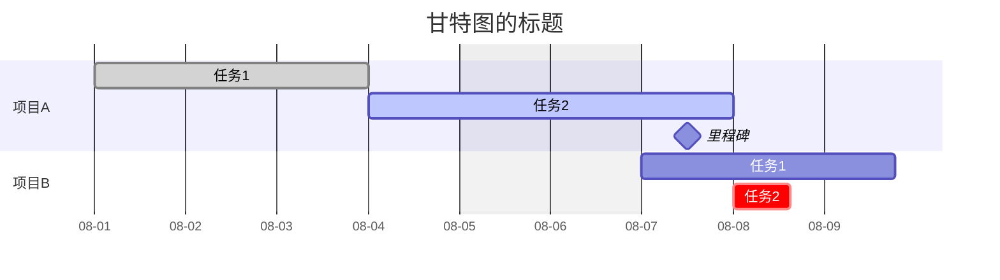

# Mermaid能绘制的内容

|     关键字     |   图类型   |     关键字     | 图类型 |
| :------------: | :--------: | :------------: | :----: |
|     `pie`      |   饼状图   |    `graph`     |   图   |
|     `flow`     |   流程图   |    `gantt`     | 甘特图 |
| `classDiagram` |    类图    | `stateDiagram` | 状态图 |
|   `journey`    | 用户旅程图 |                |        |

## 图（Graph）



## 类图（classDiagram）



## 其他类型图（pie、stateDiagram、journey）




# 甘特图

## 相关参数

### title（甘特图标题）

```
title 甘特图的标题
```

### dateFormat（输入时间格式）

```
dateFormat YYYY-MM-DD %%输入数据的时间格式
```

| 标记 |         含义          | 标记 |         含义          |
| :--: | :-------------------: | :--: | :-------------------: |
| YYYY |        四位年         |  h   | 无0补齐的时，12小时制 |
|  YY  |        两位年         |  hh  |  两位的时，12小时制   |
|  M   |      无0补齐的月      |  m   |      无0补齐的分      |
|  MM  |       两位的月        |  mm  |       两位的分        |
|  D   |      无0补齐的日      |  s   |      无0补齐的秒      |
|  DD  |       两位的日        |  ss  |       两位的秒        |
|  H   | 无0补齐的时，24小时制 | Z ZZ |        UTC时区        |
|  HH  |  两位的时，24小时制   |      |                       |

### axisFormat（输出时间格式）

```
axisFormat %m-%d %%显示在时间轴上的格式
```

| 标记 |       含义       | 标记 |        含义        |
| :--: | :--------------: | :--: | :----------------: |
|  %Y  |      四位年      |  %H  | 两位的时，24小时制 |
|  %y  |      两位年      |  %I  | 两位的时，12小时制 |
|  %m  |      两位月      |  %M  |      两位的分      |
|  %d  |  0补齐的两位日   |  %S  |      两位的秒      |
|  %e  | 空格补齐的两位日 |      |                    |

### excludes（排除的时间）

```
excludes weekends 2023-08-09  %%排除的时间
excludes weekends, 2023-08-09  %%排除的时间
```

在甘特图上排除的时间（显示为灰色），用空格或者逗号分隔。

用`weekends`可以直接排除所有周末。

### todayMarker（“今日”标记）

是否显示当前日期（默认为显示）

参数值：on/off

### section（项目名称）

```
section 项目名称
	任务1
	任务2（可选）
	里程碑（可选）
```

### 任务

**任务描述**

```
%% 任务描述 : [任务状态,] [任务名称,] 开始时间, 时长或结束时间
任务1 : done, a1, 2023-08-01, 3d
任务2 : active, a2, after a1, 2023-08-08
```

其中开始时间可以使用：`after 其他任务名称`的方式确定

**任务状态**

|  状态  |               描述               |
| :----: | :------------------------------: |
|  done  |              已完成              |
| active |           激活，进行中           |
|  空白  |          默认，尚未实施          |
|  crit  | 关键任务，可以与其他状态叠加使用 |

### milestone（里程碑）

```
里程碑 : milestone, a3, 2023-08-07, 1d
```

关键字`milestone`声明的任务为里程碑，实际显示的位置为任务时间段的正中间。

具体使用可以将milestone当作一个任务的任务状态进行使用。


## 甘特图示例

```





gantt
	title 甘特图的标题
    dateFormat YYYY-MM-DD
	axisFormat %m-%d
    excludes weekends
    todayMarker on
    section 项目A
    	任务1 : done, a1, 2023-08-01, 3d
    	任务2 : active, a2, after a1, 2023-08-08
    	里程碑 : milestone, a3, 2023-08-07, 1d
	section 项目B
    	任务1 : b1, 2023-08-07, 4000m
    	任务2 : crit, b2, after a2, 15h


