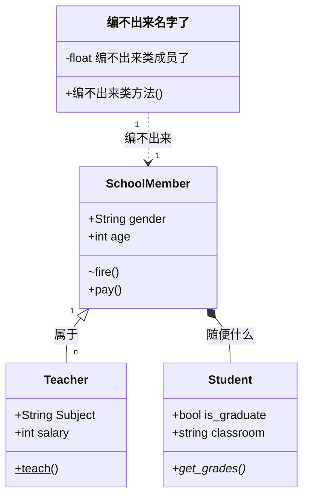

# Mermaid能绘制的内容

|     关键字     |   图类型   |     关键字     | 图类型 |
| :------------: | :--------: | :------------: | :----: |
|     `pie`      |   饼状图   |    `graph`     |   图   |
|     `flow`     |   流程图   |    `gantt`     | 甘特图 |
| `classDiagram` |    类图    | `stateDiagram` | 状态图 |
|   `journey`    | 用户旅程图 |                |        |

## 图（Graph）

<a href="https://www.6young.site/blog/df7c1bab.html" target="cardlink_"></a>



## 甘特图（gantt）



## 其他类型图（pie、stateDiagram、journey）




# 类图

## 类间关系

|     参数      |       含义        |     参数      |         含义         |
| :-----------: | :---------------: | :-----------: | :------------------: |
| `<`&#124;`--` | Inheritance，继承 |     `--`      | Link(Solid)，硬链接  |
|     `*--`     | Composition，构成 |     `<..`     |   Dependency，依赖   |
|     `o--`     | Aggregation，聚合 | `<`&#124;`..` |  Realization，实现   |
|     `<--`     | Association，联合 |     `..`      | Link(Dashed)，虚连接 |

这些箭头都可以指向右边，如 ` <|..`变为`..|>`即可。

## 类成员可见性

| 参数 |   含义    | 参数 |       含义       |
| :--: | :-------: | :--: | :--------------: |
| `+`  |  Public   | `-`  | Package/Internal |
| `#`  | Protected | `~`  | Package/Internal |

## 类方法可见性

| 参数 |   含义   | 参数 |  含义  |
| :--: | :------: | :--: | :----: |
| `*`  | Abstract | `$`  | Static |

## 类图示例

```




classDiagram
	%% 构建类
    class SchoolMember {
        +String gender
        +int age
        ~fire()
        +pay()
    }
    class Teacher {
    	+String Subject
    	+int salary
    	+teach()$
	}
	class Student {
	    +bool is_graduate
	    +string classroom 
	    +get_grades()*
	}
	class 编不出来名字了 {
	    -float 编不出来类成员了
	    +编不出来类方法()
	}
	%% 构建类间关系
	SchoolMember "1" <|-- "n" Teacher: 属于
	SchoolMember *-- Student: 随便什么
	编不出来名字了 "1" ..> "1" SchoolMember: 编不出来




